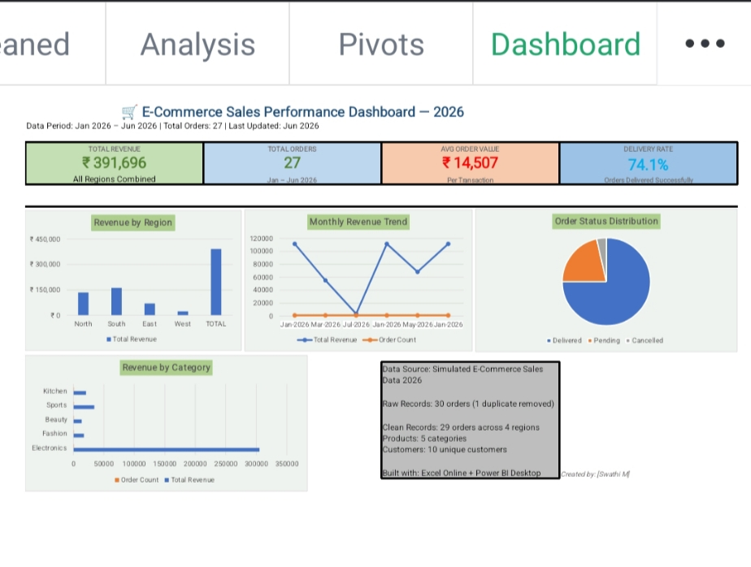
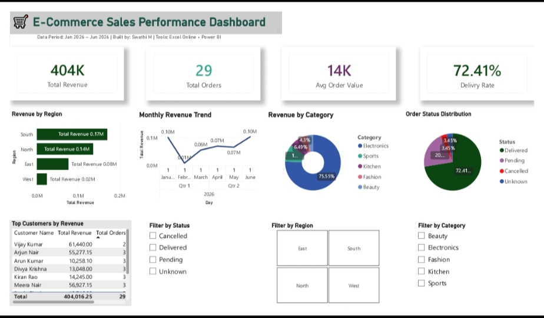
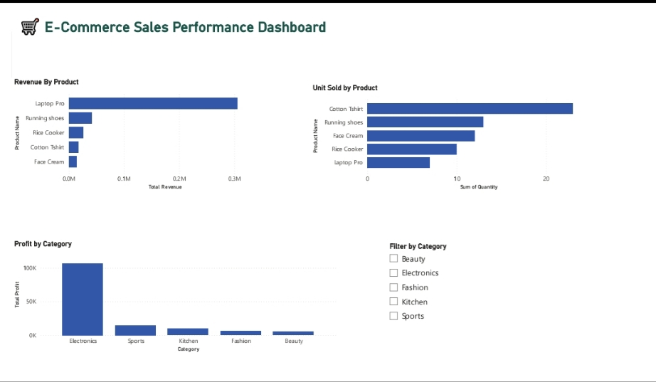
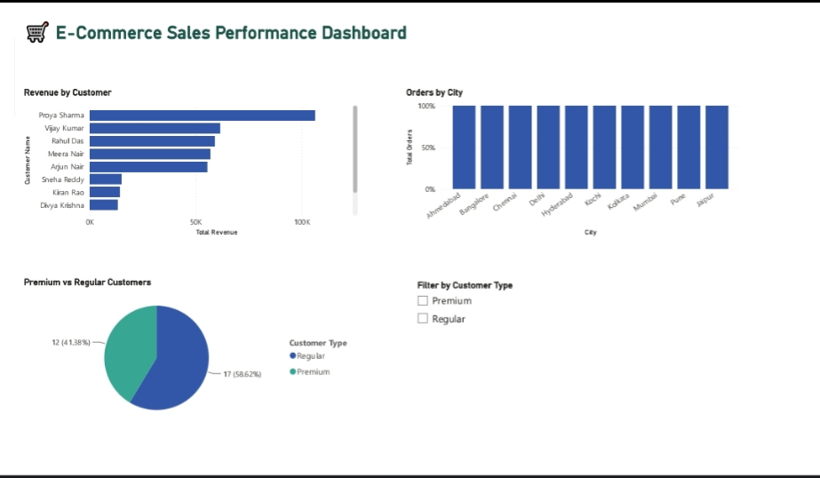

# 🛒 E-Commerce Sales Analytics Project

**A complete end-to-end data analytics project built using Microsoft Excel Online and Power BI Desktop**

---

## 📊 Project Overview

This project simulates a real-world data analyst workflow — from receiving messy raw data to delivering a professional interactive dashboard for business decision-making.

**Built by:** Swathi M
**Tools:** Microsoft Excel Online + Power BI Desktop
**Data Period:** January 2026 – June 2026
**Dataset:** 29 e-commerce orders across 4 regions, 5 product categories, 10 customers

---

## 🎯 Business Questions Answered

- Which region generates the most revenue?
- Which product category is most profitable?
- What is the monthly revenue trend?
- Who are the top customers by revenue?
- What is the order delivery success rate?
- How does revenue break down by product and category?

---

## 📁 Project Structure

| Sheet / File | Contents |
|---|---|
| RawData | 30 rows of intentionally messy source data |
| ProductDB | 5 products with prices and profit margins |
| CustomerDB | 10 customers with city, state, type |
| Cleaned | 29 rows cleaned using 20 Excel formulas |
| Analysis | 6 analysis tables + 10 KPI metrics |
| Pivots | 3 Pivot Tables with slicers |
| Dashboard | KPI cards + 4 charts + interactive slicers |
| Power BI | 3-page interactive report with DAX measures |

---

## 🛠️ Skills Demonstrated

### Excel Skills
- ✅ Data cleaning — TRIM, PROPER, SUBSTITUTE, IFERROR, DATEVALUE
- ✅ Lookup formulas — VLOOKUP, INDEX MATCH
- ✅ Aggregation — SUMIF, SUMIFS, COUNTIF, COUNTIFS, AVERAGEIF
- ✅ Logic — IF, AND, OR, IFS, nested IF
- ✅ Text functions — LEFT, MID, RIGHT, LEN, FIND, TEXT
- ✅ Date functions — DATEDIF, EOMONTH, DATEVALUE, TEXT
- ✅ Advanced — LARGE, SMALL, RANK, SUMPRODUCT, MINIFS
- ✅ Pivot Tables with grouping, slicers, and calculated fields
- ✅ Conditional Formatting — color scales, data bars, icon sets
- ✅ Data Validation — dropdown lists, input messages, error alerts
- ✅ Named Ranges for readable formulas
- ✅ Power Query — data transformation and ETL
- ✅ KPI Dashboard with 4 cards and 4 charts

### Power BI Skills
- ✅ Data connection from Excel workbook
- ✅ Power Query transformations in Power BI
- ✅ Data model with table relationships
- ✅ DAX measures — SUM, COUNTROWS, DIVIDE, FILTER, CALCULATE, DATEADD
- ✅ Interactive dashboard with slicers
- ✅ 3 report pages — Sales, Products, Customers
- ✅ KPI cards, bar charts, line charts, donut charts, pie charts, tables

---

## 📸 Dashboard Screenshots

### Excel Dashboard

### Power BI Sales Dashboard

### Power BI Product Analysis

### Power BI Customer Analysis

---

## 📈 Key Insights from the Data

- **South region** generates the highest revenue at ₹1,62,472 (41% of total)
- **Electronics** is the top category contributing ₹3,05,250 (78% of total revenue)
- **June 2026** was the best month with ₹91,338 revenue across 10 orders
- **Priya Sharma** is the top customer with ₹1,06,290 total spend
- **74.1% delivery rate** — 20 of 27 orders delivered successfully
- **Laptop Pro** drives the most revenue at ₹55,000 per unit

---

## 🚀 How to Use This Project

### Excel File
1. Download `Ecommerce_Sales_Analytics.xlsx`
2. Open in Excel 2016 or later / Excel Online
3. Start from the RawData sheet to see the messy source data
4. Go to Cleaned sheet to see all cleaning formulas
5. Go to Analysis sheet to see formula-based analysis
6. Go to Dashboard sheet to see the KPI dashboard

### Power BI File
1. Download `Ecommerce_Sales_Dashboard.pbix`
2. Open in Power BI Desktop (free download from microsoft.com)
3. Use the slicers to filter by Region, Category, and Status
4. Navigate between 3 pages using tabs at the bottom

---

## 📚 What I Learned

This project covered the complete data analyst workflow:
1. **Data Collection** — understanding source data structure
2. **Data Cleaning** — identifying and fixing 6 types of data quality issues
3. **Data Analysis** — building 6 analysis tables answering business questions
4. **Data Visualization** — creating dashboards in Excel and Power BI
5. **Storytelling** — presenting insights clearly for business stakeholders

---

## 🔗 Connect With Me

Built as part of a complete Excel + Power BI.

*If you found this project helpful, please ⭐ star the repository!*
